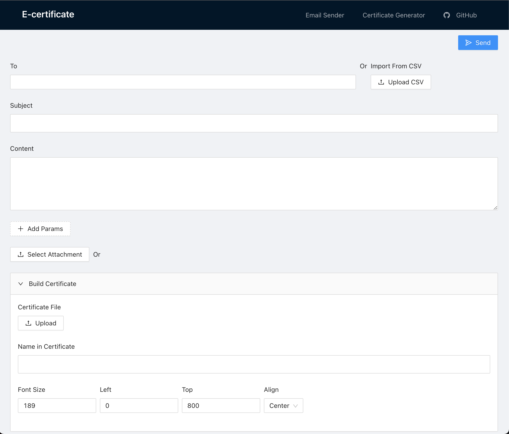

# E-certificate Generator & Bulk Email Sender by Bahasa.ai

A service for preparing the biggest event with features:

 - email sender (single and multiple recipients),
 - e-certificate generator with auto send to email,
 - etc

## Guide Started

 0. Give this repo a star and clone
 0. Copy `.env-example` to `.env` and fill the [variables](#environment-variables)
 0. Using `yarn`, run `yarn install`
 0. Run `yarn run build` to build the react and server side app
 0. Run `node dist/index.js`

## Environment Variables
|   |   |
|---|---|
| PORT | *(default: 6996)* |
| EMAIL_SMTP_HOST | *email host* |
| EMAIL_SMTP_PORT | *email port* |
| EMAIL_SMTP_USER | *username email* |
| EMAIL_SMTP_PASS | *email password* |
| EMAIL_FROM | *email from* |

## License

[MIT](./LICENSE.md)

